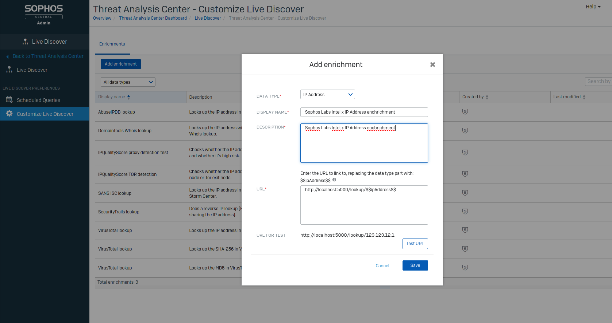

# Sophos Labs live discover enrichment.
The ability to add custom enrichment has been added to Sophos Central Threat Analysis Center (EDR/XDR) to lookup IP Addresses and File Hashes with Live Discovery. This tool has been written as an example for basic integration with Sophos Labs [Intelix](https://api.labs.sophos.com/doc/index.html#overview).

## Deployment
This can be ran locally with run.py the intelix Client Id and Client Secret added to .env, the mandatory environment variables are:

INTELIX_CLIENT_ID=

INTELIX_CLIENT_SECRET=

# The other easy solution to self host is using Heroku. #
1. Fork this repository.
2. Create a new application in Heroku.
3. In Heroku under 'deploy' connect GitHub and give it access to the forked repository.
4. Under 'settings' add the 'heroku/python' build pack and add the Config Vars INTELIX_CLIENT_ID and INTELIX_CLIENT_SECRET.
5. Go back to 'deploy' and click 'Deploy Branch'.

# Sophos Central Setup: #
1. In Sophos Central go to Threat Analysis Center > Live Discover > Customize Live Discover
2. Click 'Add Enrichment'
3. Select 'IP Address' or 'SHA256'
4. Add Display Name 'Sophos Labs Intelix IP Address enchrichment'
5. Add Description 'Sophos Labs Intelix IP Address enchrichment'
6. Add URL for the application server hxxp://localhost:5000/lookup/\$$ipAddress$$
7. Test the URL

## Usage ##
For a JSON reponse you can use hxxp://example.com/lookup/\<ip> or hxxp://example.com/lookup/\<hash>

For a HTTP reponse you can use hxxp://example.com/lookup/ui/\<ip> or hxxp://example.com/lookup/ui/\<hash>